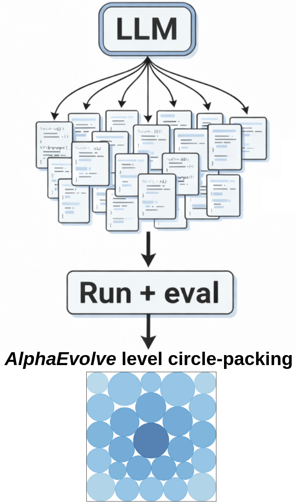
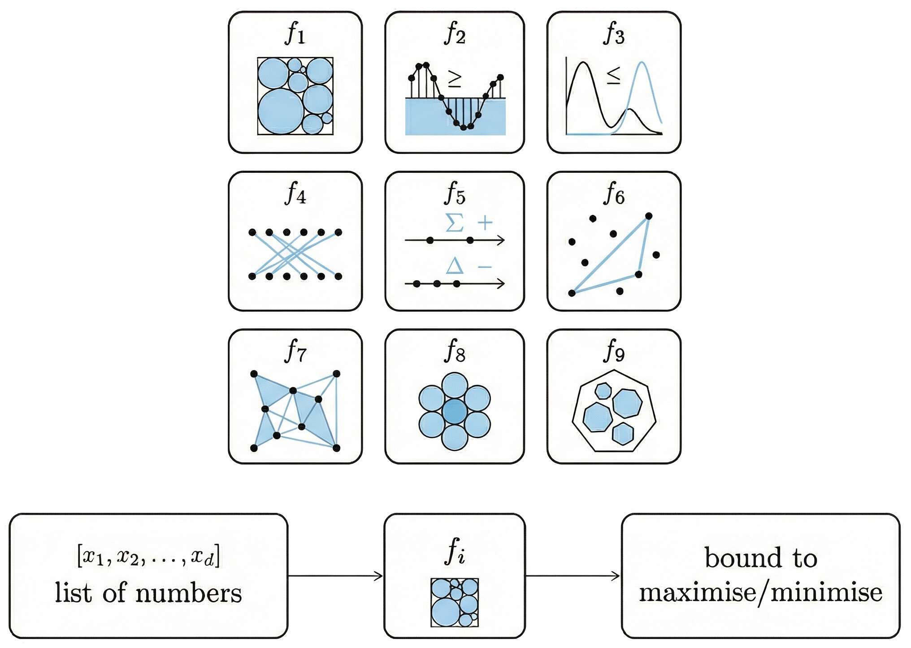
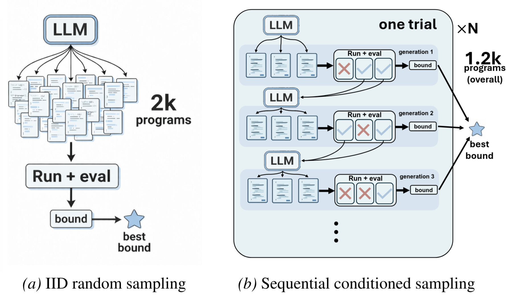
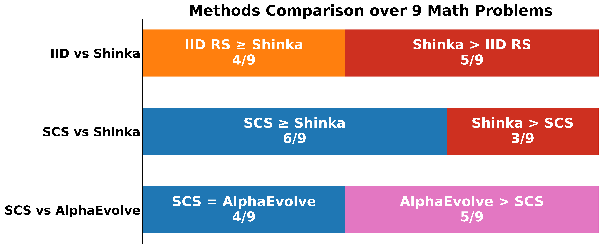
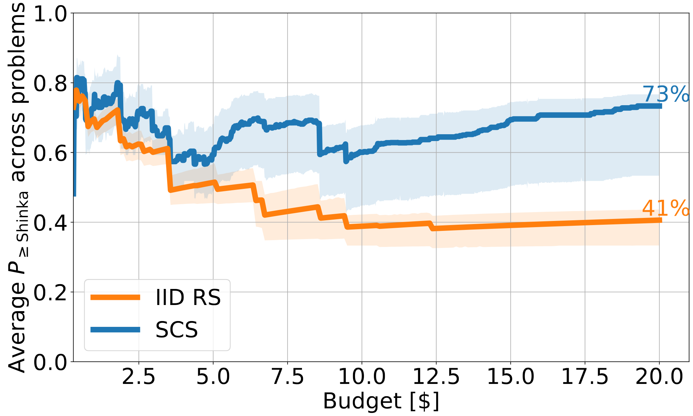
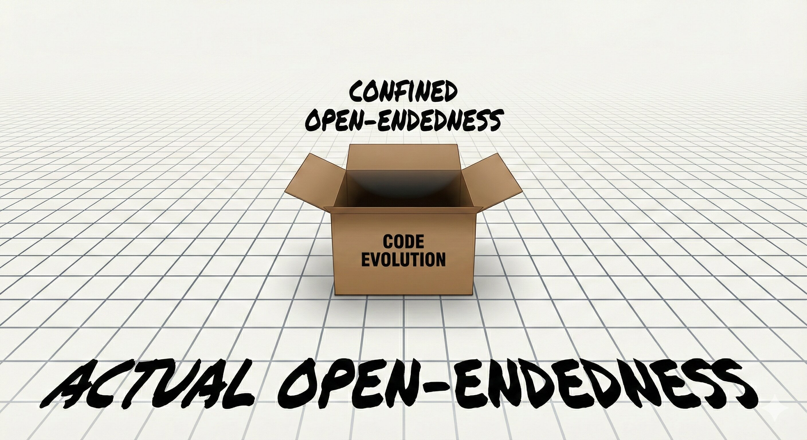
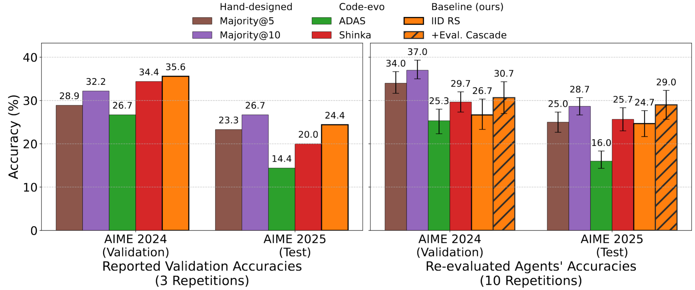
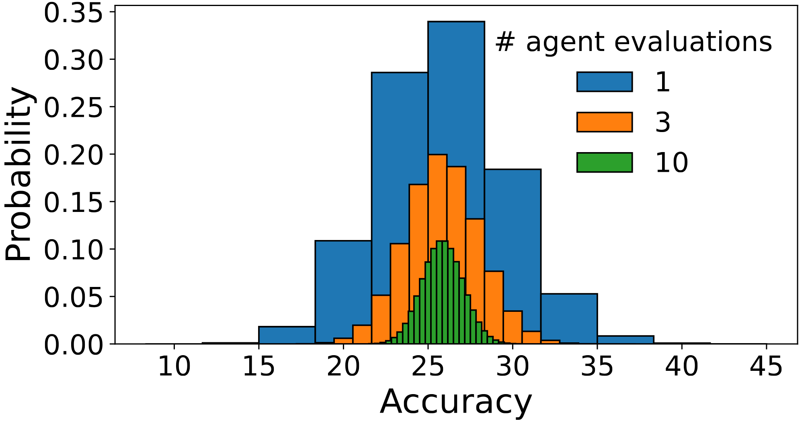

A few months ago I read the AlphaEvolve paper[@novikov2025alphaevolve] and found it really interesting. I started working on a project building on it and, as a sanity, ran some simple baselines. Surprisingly, they performed really well -- relative to AlphaEvolve, randomly sampling from an LLM many times quickly gave the same results.

This led me down a rabbit hole, comparing some simple baselines to much fancier code evolution methods and finding that the baselines often get the same or even better performance. Trying to understand why the simple methods worked so well uncovered various insights and shortcomings with how code evolution is used.

## What's code evolution?

In this context, code evolution means using a language model to find programs that solve some problem. Typically this is done by using the language model as the mutation/recombination operator in an evolutionary algorithm. In practice there are many other design choices like ensembling models, using an evolutionary database to improve diversity, and so on to increase performance, efficiency, etc. See section 2 of the AlphaEvolve paper for more details.

One interesting use-case of code evolution is to find new, improved mathematical bounds. To illustrate, consider the circle packing problem -- given a unit square with $n$ circles, what should their centers and radii be so the sum of radii is maximized? One way to find a bound is by proposing a set of centers and radii, where -- if the configuration is valid -- gives a lower bound on the max sum of radii. Code evolution finds a program that either constructs such a packing directly or itself automatically searches over different configurations.

## Baselines

We tested two fairly simple baselines. The first is IID random sampling (IID RS) from an LLM -- asking it to produce code that solves some problem and sampling from it many times. The second baseline, sequential conditioned sampling (SCS), is very similar but is aimed at better handling sequential problems, e.g. where the solution results from iteratively growing a list over time. Specifically, after generating a set of programs, some of those that ran successfully are randomly picked to be appended to the prompt when generating a program in the next generation. This is repeated for a few generations^[{In the evolutionary algorithms sense of the word.}] and, optionally, then restarted from scratch.

## Simple baselines are competitive in discovering mathematical bounds

As AlphaEvolve is closed source, for a fair comparison we compare the baselines to an open-source alternative, ShinkaEvolve [@lange2025shinkaevolve], giving all methods a $20 budget per problem. Using 9 of the math problems from the AlphaEvolve paper as a test bed we find that the baselines perform surprisingly well, with SCS matching or exceeding ShinkaEvolve on 6/9 problems and similarly for AlphaEvolve on 4/9. This is while AlphaEvolve likely uses a much higher budget. In general, the baselines perform well relative to ShinkaEvolve over a variety of budgets.

These results are pretty surprising. Most code evolution pipelines, like Alpha/Shinka/OpenEvolve [@novikov2025alphaevolve;@lange2025shinkaevolve;@openevolve], seem to have taken a lot of work and involve many design choices, so I didn't expect methods that you can code up in a few hours to be so competitive. If many of the search's design choices minimally affect the discovered bounds, then what does?

### The search isn't open-ended where it matters: better verifiers lead to larger improvements than changing the search pipeline

Each problem's search space is implicitly defined by its verifier. A verifier is a function that gets as input a list of numbers and outputs the resulting bound. For involved math problems these verifiers can be a result of long derivations, specifying how a class of functions relates to some bound. These functions are then parameterized with a list of numbers, which the verifier translates into a new bound. Thus, a given verifier defines a problem's search space, with the specific verifier being a result of how the problem is formulated.

To illustrate, here's a simple example for circle packing. The default verifier most code evolution pipelines use takes as input the centers and radii, checks whether they form a valid packing, and then sums the radii to find a new bound. However, given only a list of centers it's possible to find the maximum sum of feasible radii automatically, using a linear program. Although both verifiers have the same performance ceiling, the latter verifier has a different search space as it takes as input only the circle centers.

Circle packing linear program

Let $x_i,y_i$ and $r_i$ respectively denote the center and radius of circle $i$. Given $n$ circles in a unit sqaure, each radius has the following constraints:
[add a simple diagram]
1. The circle can't touch the left/right walls: $x_i>r_i$ and $1> x_i+r_i$.
2. Similarly, the circle can't touch the floor or the ceiling: $y_i>r_i$ and $1> y_i+r_i$.
3. No two circles can overlap. Denoting $d_{ij}$ as the distance between the centers of circles $i$ and $j$, no overlap means that $r_i+r_j<d_{ij}$.

As the maximization objective is $\sum_{i=1}^n r_i$, both the objective and the $O(n^2)$ constraints are linear, so the maximum sum of radii can efficiently be found using any off-the-shelf linear programs solver, e.g. `scipy.optimize.linprog`. Formally, the resulting linear program is:

$$
\begin{aligned}
\max_{r_1,\dots,r_n} \quad & \sum_{i=1}^{n} r_i \\
\text{s.t.} \quad
& r_i + r_j < d_{ij}, && 1 \le i < j \le n, \\
& r_i < x_i\wedge r_i < 1 - x_i\wedge r_i < y_i\wedge r_i < 1 - y_i, && i = 1,\dots,n, \\
& r_i > 0, && i = 1,\dots,n.
\end{aligned}
$$

A different verifier can result in finding a better bound, as is the case in one of the other problems, an uncertainty inequality. For this problem, AlphaEvolve improved the bound from a previous known best of 0.3523 to 0.3521. All three tested methods here, the two baselines and ShinkaEvolve, discovered the 0.3521 bound as well. After AlphaEvolve came out Henry Cohn commented that there are other formulations which yield even better bounds, see Appendix B.4 of [AlphaEvolve] for details. To illustrate this, I took the problem's default setup and reformulated it, specifically making it easier to optimize and use a larger function class. In practice, the reformulation results in having a different prompt and verifier. The new setup resulted in all three methods finding a new bound of 0.3482, which is better than the previous one of 0.3521, while also constituting a larger relative improvement than its predecessor of 0.3523. However, __this improvement stems from a domain expert's effort, not the automated search process__, as all three tested methods found the same bound.

The uncertainty inequality and its modified formulation

The following section is taken almost verbatim from Appendix I of our paper. We first describe the problem in its generality, based on Appendix B.4 of AlphaEvolve and Gonccalves et al.[@gonccalves2017hermite] For a function $f:\mathbb{R}\to\mathbb{R}$ define its Fourier transform as $\hat{f}(x)=\int_{-\infty}^\infty f(t)e^{-2\pi i xt}dt$. Let the radius of the smallest disc for which outside of it $f$ is nonegative be defined as $A(f)\coloneqq \inf(\{r>0|\forall |x|\geq r:f(x)\geq 0\})$. In the uncertainty inequality problem we wish to find the smallest constant $C$ for which $A(f)A(\hat{f})\geq C$, under the conditions where a) $f$ is even and b) $\max(f(0),\hat{f}(0))\leq0$.

Denoting the $n\text{th}$ Hermite polynomial as $H_n$, Gonccalves et al. show that functions of the form $f(x)=\sum_{n=0}^\infty \alpha_nH_{4n}(\sqrt{2\pi}x)e^{-\pi x^2}$ fulfill the two conditions given that the coefficients $\alpha_n$ are chosen so $f(0)=0$. As here $\hat{f}(x)=f(x)$, this automatically fulfills condition b). As even Hermite functions are even, this fulfills condition a).

Gonccalves et al. construct their lower bound of 0.3523 by setting all $\alpha_n$ except for $\alpha_0,\alpha_1,\alpha_2,\alpha_3$ to zero and numerically finding which $\alpha\text{s}$ minimize $C$. This is the formulation also used by AlphaEvolve and in our main results.

We modify this formulation in two ways. First, AlphaEvolve uses physicist's Hermite polynomials, where the leading coefficient of $H_n$ is $2^n$. This leads to numerical instabilities when attempting to use higher orders. Instead, we use the probabilist's Hermite polynomials, which are the same but rescaled, so $He_n\coloneqq \frac{H_n}{2^n}$, resulting in the leading coefficient for all polynomials being one. Our second modification is setting all $\alpha\text{s}$ beyond $\alpha_7$ to zero instead of $\alpha_3$. This allows $f(x)$ to represent a larger class of functions. It is likely possible going beyond $\alpha_7$ and reducing the bound further but we encountered numerical instabilities when trying to do so, likely from using very high order polynomials.

Code evolution is often claimed to be an open-ended search process, where given sufficient time any novel solution can be discovered as most programming languages are Turing complete [@hu2024automated]. However, the verifiers, which evidently significantly affect both the search's performance ceiling and efficiency, are fixed. Thus, __code evolution is open-ended only within the confines of a box, whereas searching outside of that box is what matters__.

True open-endedness would be capable of changing everything, including the verifier and hence the search space itself. This is nontrivial as the new verifier must still yield valid bounds, thereby constraining possible modifications.^[{While some modifications, like the circle packing linear program, could feasibly be generated within the confines of the current setup, in practice I didn't see any similar programs generated.}]

### Domain knowledge can make the search much more efficient

Methods like Alpha/Shinka/OpenEvolve are initialized with an initial program and some prompt, used to generate new programs. This prompt contains the problem's specification but potentially much more, such as hints on how to approach it. For example, OpenEvolve's circle packing prompt describes properties of typical good packings, the best known bounds, and various other nontrivial pieces of information.

OpenEvolve circle packing prompt

You are an expert mathematician specializing in circle packing problems and computational geometry. Your task is to improve a constructor function that directly produces a specific arrangement of 26 circles in a unit square, maximizing the sum of their radii. The AlphaEvolve paper achieved a sum of 2.635 for n=26.

Key geometric insights:
- Circle packings often follow hexagonal patterns in the densest regions
- Maximum density for infinite circle packing is pi/(2*sqrt(3)) ≈ 0.9069
- Edge effects make square container packing harder than infinite packing
- Circles can be placed in layers or shells when confined to a square
- Similar radius circles often form regular patterns, while varied radii allow better space utilization
- Perfect symmetry may not yield the optimal packing due to edge effects

Focus on designing an explicit constructor that places each circle in a specific position, rather than an iterative search algorithm.

These hints can be significant and accidentally lead to unfair comparisons, as a method's better performance might be due to having more knowledge, not due to it being inherently better. To illustrate, we compared how well ShinkaEvolve does when searching for circle packings using its default prompt, which is similar to the OpenEvolve prompt, or a different one that specifies the problem and has minimal domain knowledge. Running each setup for 3 times with a $20 budget, ShinkaEvolve finds an essentially optimal packing in 3/3 times when given the domain knowledge prompt but only 1/3 times given the minimal prompt.^[{By an essentially optimal packing I mean one that has a sum of radii of 2.63598.}]

A recent paper by Terence Tao and others showed similar results [@georgiev2025mathematical]. There, they used AlphaEvolve to search for better bounds over a set of 67 problems. On page 7 they note that
> ...we have found that the advice one gives to AlphaEvolve in the prompt has a significant impact on the quality of the final construction. Giving AlphaEvolve an insightful piece of expert advice in the prompt almost always led to significantly better results...

This has important implications both for method development and AI-assisted scientific discovery. When developing methods its important to have comparisons use the same domain knowledge in the prompts, otherwise improvements might be from the auxiliary knowledge and not the method itself. For scientific discovery, when reporting results it is important to also mention the knowledge used to steer a method, as it can be what ultimately enables the discovery.

## Other domains

Given these results for math problems, I was curious whether the baselines would perform well similarly in other settings, and what insights this might reveal there. This is especially interesting as the baselines might perform well under some constraints but not others. For the math problems the main bottleneck is the API budget, whereas in other cases the limit might be wall-clock time or the number of evaluations used. For the wall-clock time constraint a classic setting is machine learning competitions from MLE-bench, where each method has 24 hours to run. One case where there is a limited number of function evaluations is when searching for agentic scaffolds, with the number of evaluations being limited as each one is very expensive.

Over both domains I compared the baselines to purpose-built code evolution methods. Surprisingly, the baselines also performed here quite well. How come?

### Agentic scaffold evaluations can be highly stochastic

What's an agentic scaffold? How does code evolution find one?

Let's say you want to solve a math problem using an LLM. You can go to ChatGPT and ask it to give you an answer, then you ask it to double-check that answer, maybe post it into a new chat with some questions about it, and so on. An LLM scaffold is a set of LLM calls that does this automatically, where the final output should be the answer to the original math question. These consist of LLM calls with different prompts, perhaps with some additional processing, so a scaffold can straightforwardly be defined in code.

Thus, searching for a scaffold amounts to doing regular code evolution, albeit with very expensive evaluations. Typically a scaffold is limited to some amount of LLM calls per question evaluation, say 10, so evaluating 100 questions can result in 1000 LLM calls. Depending on the LLM used, an evaluation can typically cost $1-$10.

Specifically for finding agentic scaffolds, I noticed an odd result: while the IID RS baseline seemingly outperformed scaffolds found using other code evolution methods, it fell short of a hand-designed majority vote baseline. Majority vote means generating $k$ answers, with $k$ here being 5 or 10, and picking the most prevalent one as the answer.

Independently re-evaluating all scaffolds more times revealed what's going on, that the selected scaffolds were luckier than they were performant. To keep the evaluation economic scaffolds are typically evaluated on relatively small datasets, having effectively ~100 questions (including repeats). This results in very noisy evaluations, with a majority vote@5 scaffold still having a standard deviation of ~1% when evaluated on AIME 2025 10 times.^[{Each AIME year has 30 questions, so re-evaluating a scaffold 10 times results in an effective dataset size of 300 questions.}] Thus, when automatically searching over scaffolds many of the best performing scaffolds could only seem well performing, whereas in practice due to the stochasticity they were just lucky.

This can be solved using a) an evaluation cascade and b) better comparing different scaffolds. The evaluation cascade independently re-evaluates high-performing scaffolds, using more samples or a larger dataset than before, to find a better estimate of a scaffold's true performance. While it is possible to then pick the scaffold with the highest mean performance, this could be misleading, as a high mean could still be due to a single lucky highly performant evaluation. To mitigate this we recommend using the _probability of dominance_, a generalization of Agarwal et al.'s [@agarwal2021deep] probability of improvement. The probability of dominance estimates the probability method (scaffold) $A_1$ outperforms methods $A_2,A_3,...A_M$, thereby being more robust than point estimates as it relies on the entire distribution of sampled accuracies. Using an evaluation cascade in conjunction with the probability of dominance to pick the best scaffold enables finding a scaffold that robustly achieves better performance.

Probability of dominance

This section is copied almost verbatim from our Appendix K. The probability of dominance is the probability method $A_1$ is better than (''dominates'') methods $A_2,A_3,...,A_M$. We denote their scores as $a_1^{(1)},a^{(1)}_2,...,a_N^{(1)},a_1^{(2)},a_2^{(2)},...$, with the upper index indicating the method. $P(A_1 > A_2, A_3, \dots, A_M)$ is defined as

$$
P(A_1 > A_2, A_3, \dots, A_M)=
\frac{1}{N^M}
\sum_{a^{(1)} \in A_1}
\cdots
\sum_{a^{(M)} \in A_M}
S\left(a^{(1)},\dots,a^{(M)}\right),
$$

where

$$
S(a^{(1)},\dots,a^{(M)}) =
\begin{cases}
1,
& \text{if } a^{(1)} > \max_{m \ge 2} a^{(m)}, \\[6pt]
\dfrac{1}{\left|\{m \ge 2 : a^{(m)} = a^{(1)}\}\right|},
& \text{if } a^{(1)} = \max_{m \ge 2} a^{(m)}, \\[10pt]
0,
& \text{otherwise.}
\end{cases}
$$

The second case in $S$ means that success probabilities are evenly split across the top methods in the case of ties. We refrain from the notation $P(A_1>\max(A_2,...,A_M))$ as the probabilities are calculated over the empirical distributions, not point estimates. Although illustrated here for $A_1$ versus $A_2,...,A_M$ note that the method ordering is arbitrary.

Although it is expensive to calculate the probability of dominance exactly, it can be efficiently estimated using Monte-Carlo. Comparing more methods will lead any individual method's probability of dominance to generally be lower, with several top methods likely having similar probabilities.

## In conclusion

For reinforcement learning there have been an abundance of papers over the years showing that methods are not evaluated properly, seemingly innocous design choices are actually significant, and some improvements are not as robust as they seemed. Code evolution might be a similar wild west to what RL once was, where the field is blooming but what matters isn't yet fully understood.

More methodical approaches, like relying on simple methods and gradually building them up, could offer a way forward. When something seems fishy it can be investigated in isolation, and the sources of improvements are much more clear.^[{There are many interesting tidbits we found while investigating the baselines that didn't make it either to the paper or to this blogpost. For example, although many code evolution methods have various mechanisms designed to increase diversity, in practice they tend to get locked into bad search paths. This leads to "code bloat" [@langdon1997fitness], where the programs become longer and longer but effective improvements grind to a halt.}] This is only part of the story, as good comparisons also require standardized benchmarks, which are only starting to emerge.

Part of the reason the shortcomings we found weren't widely discussed before is likely due to conflating proposing good search methods and scientific discovery. A scientific discovery is valuable in and of itself, but it might be possible finding it using a very simple search. When proposing search methods it's important to compare them to simple baselines while having the same settings (prompts and hence domain knowledge, verifiers, etc.). Meanwhile, scientific discoveries should specify the exact domain knowledge used, problem formulation, and so on as that guidance may be what made the discovery at all possible.

You can find the full paper here and the code here, including some minimal example notebooks. In conclusion, we recommend that:
- Future methods run fair comparisons, using the same prompts and hence domain knowledge, verifiers and hence search spaces, budgets, and any other factors that could be meaningful. Otherwise, improvements could be not from the underlying search method but other, orthogonal changes.
- When automatically searching for agentic scaffolds, use an evaluation cascade to reduce stochasticity and the probability of dominance to robustly pick out the best one. When reporting results we recommend using 95% confidence intervals as the distribution of answers is often noisy.
- Future works clearly say if their main contribution is a scientific discovery or a new search method they propose. If it's a discovery then the problem formulations and domain knowledge used in the prompts should be clearly shared, as they may be what enabled the discovery. For search methods, use simple baselines!